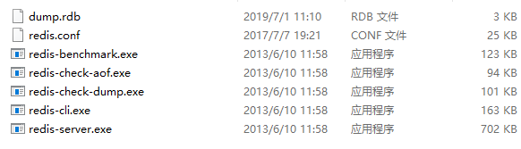

# Redis学习笔记
<!-- TOC -->
  - [Redis学习笔记](#Redis学习笔记)
    - [Redis简介](#Redis简介)
      - [特点](#特点)
      - [Redis目录结构](#Redis目录结构)
      - [Redis的启动方式](#Redis的启动方式)
      - [Redis客户端连接](#Redis客户端连接)
      - [Redis常用配置](#Redis常用配置)
      - [通用命令](#通用命令)
      - [单线程](#单线程)
    - [Redis API使用](#Redis-API使用)
      - [字符串string](#字符串string)
      - [哈希Hash](#哈希Hash)
      - [列表list](#列表list)
      - [集合set](#集合set)
      - [有序集合zset](#有序集合zset)
    - [Redis客户端](#Redis客户端)
      - [Jedis的使用](#Jedis的使用)
      - [Jedis连接池](#Jedis连接池)
    - [Redis功能](#Redis功能)
      - [一、慢查询](#一、慢查询)
      - [二、pipeline流水线](#二、pipeline流水线)
      - [三、发布订阅](#三、发布订阅)
      - [四、位图Bitmap](#四、位图Bitmap)
      - [五、HyperLogLog](#五、HyperLogLog)
      - [六、GEO](#六、GEO)
    - [Redis持久化](#Redis持久化)
      - [RDB（Redis DataBase）](#RDB（Redis-DataBase）)
      - [AOF（Append Only File）](#AOF（Append-Only-File）)

<!-- /TOC -->

## Redis简介
Redis 是一个开源（BSD许可）的，内存中的数据结构存储系统，它可以用作数据库、缓存和消息中间件。  
是一个高性能的key-value数据库。  
>注：BSD开源协议是一个给予使用者很大自由的协议。基本上使用者可以"为所欲为",可以自由的使用，修改源代码，也可以将修改后的代码作为开源或者专有软件再发布。
C语言实现，5w行代码

### 特点
- 1、高性能的key-value数据库
- 2、内存中的数据结构存储系统
- 3、支持数据的持久化，可以将内存中的数据保持在磁盘中，重启的时候可以再次加载进行使用
- 4、不仅仅支持简单的key-value类型的数据，同时还提供list，set，zset，hash等数据结构的存储
- 5、支持数据的备份，即master-slave（主从）模式的数据备份

### Redis目录结构


- dump.rdb    ---redis持久化文件
- redis.conf    ---reids配置文件
- redis-benchmark.exe    ---reids性能测试
- redis-check-aof.exe    ---aof文件校验、修复功能
- redis-check-dump.exe    ---rdb文件校验、修复功能
- redis-cli.exe    ---reids命令行客户端，用于连接服务端
- redis-server.exe    ---reids服务端


### Redis的启动方式
1、最简启动  
直接运行redis-server  
2、动态参数启动  
redis-server  --port 6379  
3、配置文件方式启动  
redis-server  configPath  
>/usr/local/redis/bin/redis-server /usr/local/redis/etc/redis.conf

### Redis客户端连接
```
redis-cli  -h  192.168.211.29  -p  6379
>ping
PONG
```
默认情况下，Redis服务器默认会创建16个数据库（可以通过配置文件支持更多，无上限），每个数据库对外都是一个从0开始的递增数字命名，可以通过配置databases来修改这一数字。默认情况下，Redis客户端的目标数据库为0号数据库。

### Redis常用配置
>配置文件redis.conf

- `bind`:			     绑定ip，默认127.0.0.1
- `daemonize`:    （yes/no默认）   是否是守护进程
- `port`:   		端口号（默认6379）
- `logfile`:		redis系统日志文件名
- `dir`:			redis工作目录

### 通用命令
- keys：遍历所有的key，O(n)
- dbsize：计算key的总数，O(1)
- exists key：判断key是否存在，存在返回1，不存在返回0，O(1)
- del key[key....]：删除指定的key-value，O(1)
- expire key seconds：key在seconds秒后过期，O(1)
- ttl key：查看key的剩余过期时间，-2代表不存在即过期，-1代表key存在无过期时间，O(1)
- persist key：去掉key的过期时间，O(1)
- type key：返回key的类型（string，hash，list，set，zset，none），O(1)

### 单线程
不能两条命令同时执行，多个命令排队执行。  
- Redis为什么单线程这么快？   
最主要的原因就是，redis使用的是纯内存  
- 使用注意点：  
（1）一次只运行一个命令  
（2）拒绝长(慢)命令，如keys，不推荐使用此命令  

## Redis-API使用
### 字符串string
#### 键值结构
`key`  `value`    （value的大小限制512M）

#### 使用场景
缓存、计数器、分布式锁等

#### 常用命令：
- get key：get key获取key对应的value，O(1)
- set key value：设置key对应的value，O(1)
- del key：删除key-value，O(1)
- incr key：key自增1，如果key不存在，自增后get(key)=1
- decr key：自减1，如果key不存在，自检后get(key)=-1
- incrby key k：key自增k，如果k不存在，自增后get(key)=k
- decrby key k：key自减k，如果k不存在，自减后get(key)=-k
- set key value：不管key是否存在，都设置
- setnx key value：key不存在才设置
- set key value xx：key存在才设置
- mget key1 key2：批量获取key，O(n)
- mset key1 value1 key2 value2 ：批量设置key-value，O(n)，PS:`mget`比多次`get`操作节省网络开销
- getset key newvalue：设置新的值并返回老的值
- append key value：将value追加到旧的value
- strlen key：获取value的字符串长度，注意汉字（占两个字节）
- incrbyfloat key 3.5：增加key对应的值3.5
- getrange key start end：获取字符串指定下标所有的值
- setrange key index value：设置指定下标的值

### 哈希Hash
#### 键值结构
key  field  value

#### 特点
- （1）类似于Java的`Map<string,Map<string,string>>`
- （2）field不能重复，value可以重复

#### 使用场景
网站每个用户的主页访问量

#### 常用命令：
- hget key field：获取hash key对应的field的value，O(1)
- hset key field value：设置hash key对应的field的value，O(1)
- hdel key field：删除hash key对应的field的value，O(1)
- hexists key field：判断hash key是否有field，O(1)
- hlen key：获取hash keyfield的数量，O(1)
- hmget key field1 field2..：批量获取hash key的一批field对应的值，O(n)
- hmset key field1 value1 field2 value2...：批量设置hash key的一批field-value，O(n)
- hgetall key：返回hash key对应所有的field和value，O(n)
- hvals key：返回hash key对应所有field的value，O(n)
- hkeys key：返回hash key对应所有field，O(n)
- hsetnx key field value：设置 hash key对应field的value，如果存在不设置，O(1)
- hincrby key field intCounter：hash key对应的field自增intCounter，O(1)


### 列表list
#### 键值结构
key  elements（a-b-c-d...）

#### 特点
- （1）有序
- （2）可以重复
- （3）左右插入弹出

#### 使用场景
微博TimeLine

#### 常用命令
- rpush key value1 value2...：从列表右端插入值(1~N)，O(1~N)
- lpush key value1 value2...：从列表左端插入值(1~N)，O(1~N)
- linsert key before|after value newvalue：在list指定值的前|后端插入newvalue
- lpop key：从列表的左侧弹出item，O(1)
- rpop key：从列表的右侧弹出item，O(1)
- lrem key count value：根据count值，删除列表中所有value相等的值  
（1）count>0,从左到右，删除最多count个value相等的值  
（2）count<0，从右往左，删除最多count绝对值个相等的值  
（3）count=0，删除所有value相等的值  
- ltrim key start end：按照索引范围修剪列表，O(n)
- lrange key start end(包含end)：获取列表指定索引范围所有的item，O(n)
- lindex key index：获取列表指定索引的item，O(n)
- llen key：获取列表的长度，O(1)
- lset key index newvalue：设置列表指定索引的值为newvalue，O(n)
- blpop key timeout：lpop的阻塞版本，timeout是阻塞超时时间，为0永不阻塞，O(1)
- brpop key timeout：rpop的阻塞版本，timeout是阻塞超时时间，为0永不阻塞，O(1)


### 集合set
#### 键值结构
key  values

#### 特点
- （1）无序
- （2）没有重复元素
- （3）支持集合间的操作

#### 常用命令
- sadd key element：向集合key添加元素，如果存在添加失败，O(1)
- srem key element：将集合key的element移除掉，O(1)
- scrad key：集合大小
- sismember key element：判断元素是否在集合中
- srandmember key count：从集合随机挑count个元素，不会破坏集合
- spop key：从集合随机弹出一个元素，会移除
- smembers key：获取集合所有元素（无序）

#### 集合间API
- sdiff key1 key2：差集
- sinter key1 key2：交集
- sunion key1 key2：并集
#### 使用场景
微博标签、点赞人、转发人

### 有序集合zset
#### 键值结构
 key  score  element

#### 使用场景
 xx排行榜

#### 常用命令
- zadd key score element(可以是多对)：添加score和element，element不可重复，O(logN)
- zrem key element(可以是多个)：删除元素，O(1)
- zscore key element：返回元素的分数
- zincrby key increScore element：增加或减少元素的分数
- zcard key： 返回元素的总个数，O(1)
- zrank key element：获取某个元素的排名（默认从小到大）
- zrange key start end(包含)：返回指定索引范围内的升序元素[分值]
- zrangebyscore key minScore maxScore：返回指定分数范围内的升序元素[分值]
- zcount key  minScore maxScore：返回有序集合内在指定分数范围内的个数
- zremrangebyrank key start end：删除指定排名内的升序元素
- zremrangebyscore key start end：删除指定分数内的升序元素


## Redis客户端
Jedis Client是Redis官网推荐的一个面向java客户端，库文件实现了对redis各类API进行封装调用。  
jedis通信原理：jedis客户端本质上也是通过建立socket按照resp协议与redis通信  
### Jedis的使用
```
// 创建Redis客户端
Jedis jedis = new Jedis("127.0.0.1", 6379);
// 调用set 命令,返回状态标记
String code=jedis.set("s", "wusong");
System.out.println("code="+code);
// 调用get命令
String s =jedis.get("s");
System.out.println("s="+s);
```

### Jedis连接池
虽然基于内存的Redis数据库有着超高的性能，但是底层的网络通信却占用了一次数据请求的大量时间，  
因为每次数据交互都需要先建立连接，假设一次数据交互总共用时30ms，超高性能的Redis数据库处理数据所花的时间可能不到1ms，  
也即是说前期的连接占用了29ms，也就是每次new jedis都会新建tcp连接，使用后再断开连接，这对于频繁访问redis的场景显然不是高效的使用方式。  
连接池则可以实现在客户端建立多个链接并且不释放，当需要使用连接的时候通过一定的算法获取已经建立的连接，使用完了以后则还给连接池，这就免去了数据库连接所占用的时间。  
因此，通常会使用连接池的方式对Jedis连接进行管理，所有jedis对象会预先放在池子中（JedisPool），每次要连接redis，只需要在池子中借，用完了再归还给池子。  
```
JedisPoolConfig jedisPoolConfig = new JedisPoolConfig();
// 设置配置
jedisPoolConfig.setMaxTotal(1024);
jedisPoolConfig.setMaxIdle(100);
jedisPoolConfig.setMaxWaitMillis(100);
jedisPoolConfig.setTestOnBorrow(false);
jedisPoolConfig.setTestOnReturn(true);
// 初始化JedisPool
 String ip = "127.0.0.1";
int port = 6379;
int timeout = 2000;
jedisPool = new JedisPool(jedisPoolConfig, ip, port, timeout);
// 获取一个jedis连接
Jedis jedis = jedisPool.getResource();
```


## Redis功能
### 一、慢查询
#### 生命周期
client-->发送命令-->排队-->执行命令-->返回结果
- （1）慢查询发生在 执行命令 阶段
- （2）客户端超时不一定慢查询，但慢查询是客户端超时的一个可能因素

#### 两个配置
##### 1、slowlog-max-len
（1）先进先出的队列，表示慢查询最大的条数，当slowlog超过设定的最大值后，会将最早的slowlog删除  
（2）固定长度  
（3）保存在内存中  
##### 2、slowlog-log-slower-than
（1）慢查询阈值（单位：微秒），表示slowlog的划定界限，只有query执行时间大于slowlog-log-slower-than的才会定义成慢查询，才会被slowlog进行记录  
（2）slowlog-log-slower-than=0，记录所有命令  
（3）slowlog-log-slower-than<0，不记录任何命令  
#### 慢查询命令
1、slowlog get [n]：获取慢查询队列  
2、slowlog len：获取慢查询队列的长度  
3、slowlog reset：清空慢查询队列  
#### 运维经验
1、slowlog-max-len不要设置过大，默认10ms，通常设置为1ms  
2、slowlog-log-slower-than不要设置过小，通常设置1000左右  
3、定期持久化慢查询  


### 二、pipeline流水线
Redis网络命令通信  
1次时间 = 1次网络时间 + 1次命令执行时间  
当有N次命令操作  
N次时间 = N次网络时间 + N次命令执行时间  
命令时间比较快，网络时间可能会很慢  
引入流水线  
1次pipeline(n条命令) = 1次网络时间 + n次命令时间  

#### pipeline在Jedis中的使用
假设要执行10000次操作，原始的方式如下，耗时可能会非常多  
```
Jedis jedis = new Jedis("127.0.0.1",6379);
// 执行10000次
for(int i=0;i<10000;i++){
    jedis.hset("hashset:" + i, "field" + i, "value:" + i);
}
```

使用pipeline的方式，每次执行100条，执行100次  
```
Jedis jedis = new Jedis("127.0.0.1",6379);
// 执行10000次
for(int i=0;i<100;i++){
    Pipeline pipeline = jedis.pipeline();
    for(int j=i*100;j<(i+1)*100;j++){
        pipeline.hset("hashset:" + j, "field" + j, "value:" + j);
    }
    pipeline.syncAndReturnAll();
}
```

#### 使用建议
1、注意每次pipeline携带数据量  
2、pipeline每次只能作用在一个Redis节点上（集群模式中）  

### 三、发布订阅
#### 角色
1、发布者（publisher）：客户端redis-cli发布消息  
2、订阅者（subscriber）：客户端redis-cli订阅频道接收消息  
3、频道（channel）：频道在Redis server中  

#### 常用命令
publish channel message ：发布命令  
subscribe [channel]一个或多个：订阅频道  
unsubscribe [channel]一个或多个：取消订阅频道  

#### 发布订阅和消息队列的区别
1、发布订阅所有订阅者都能接收到消息  
2、消息队列是抢的模式，即只有一个订阅者接收到消息  

### 四、位图Bitmap
位图操作是用来操作比特位的，其优点是节省内存空间。  
#### 常用命令
setbit  key  offset  value：给位图指定索引设置值  
getbit  key  offset：获取指定索引的值  
bitcount key [start  end]：获取位图指定范围位值为1的个数，不指定范围获取全部   
#### 使用经验
1、type是string，最大512m  
2、注意setbit时的偏移量，可能有较大耗时  
3、位图不是绝对好  

### 五、HyperLogLog
极小的空间完成独立数量统计  
本质是string  
#### 常用命令
1、pfadd key element[...]：向hyperloglog添加元素  
2、pfcount key [key...]：计算hyperloglog的独立总数  
3、pfmerge destkey sourcekey[sourcekey...]：合并多个hyperloglog  

### 六、GEO
redis3.2+新增的功能  
地理信息定位：存储经纬度，计算两地距离，范围计算等等  
type是zset，没有删除API  

#### 常用命令
1、geoadd key longitude latitude member[ longitude latitude member...]：增加地理信息，经度、维度、地点  
2、geopos key member[member...]：获取地理位置信息  
3、geodist key member1 member2[unit]：获取两个地理位置之间的距离  
unit：m（米），km（千米），mi（英里），ft（尺）  
4、georadius：获取指定范围内地理位置信息集合  


## Redis持久化
### 持久化
什么是Redis持久化  
Redis所有数据保存在内存中，对数据的更新将异步的保存到磁盘上。  
#### 库持久化方式
1、快照（RDB）  
2、写日志（AOF）  

### RDB（Redis-DataBase）
快照文件，二进制   
Redis—创建—>RDB文件(二进制)  
RDB文件(二进制)—启动载入—>Redis  

#### 触发机制
##### 1、save（同步）
redis-cli执行save命令会生成RDB文件  
数据量比较大会造成阻塞，其他客户端命令处于等待状态  
文件策略：如存在老的RDB文件，新的文件会替换老的文件  
复杂度：O(n)  

##### 2、bgsave（异步）
客户端执行bgsave命令，生成一个fork进程，该进程去创建RDB文件  
大多情况下fork进程会非常快，极小情况下出现阻塞主进程  

##### 3、自动
达到一定条件下会自动创建RDB文件，通过配置文件策略  
默认配置方式  
- save  900  1：900秒钟出现1次数据改变
- save  300  10：300秒钟出现10次数据改变
- save  60    10000：60秒钟出现10000次数据改变  

其他相关配置
- dbfilename  dump-${port}.rdb：持久化文件名称
- dir ./：持久化文件生成的目录
- stop-writes-on-bgsave-error yes：发生错误时是否停止写入文件
- rdbcompression yes：是否采用压缩格式
- rdbchecksum yes：是否进行校验格式

#### 总结
1、RDB是Redis内存到硬盘的快照，用于持久化  
2、save通常会阻塞redis  
3、bgsave不会阻塞redis，但是会fork新进程  
4、save自动配置满足任一条件就会被执行  

### AOF（Append-Only-File）
#### RDB现存的问题
1、耗时、耗性能  
2、生成的数据不可控容易丢失数据  

AOF：当执行redis命令的时候就会往AOF日志文件写入相关信息  

#### AOF的三种策略
##### 1、always
写命令刷新到缓冲区，always会将每条命令fsync到硬盘，不会丢失数据，IO开销较大
##### 2、everysec（默认值）
写命令刷新到缓冲区，everysec会每秒把缓冲区fsync到硬盘，每秒执行一次，会丢失一秒数据
##### 3、no
写命令刷新到缓冲区，no会根据操作系统fsync到硬盘，不用管，不可控

#### AOF重写
把过期的、重复的、可优化的命令进行重写  
优点：减少硬盘占用量、加速恢复速度  
##### 两种实现方式
1、bgrewriteaof，会fork出一个线程进行AOF重写  
2、AOF重写配置  
- appendonly  yes
- appendfilename “appendonly-${port}.aof”
- appendfsync everysec
- auto-aof-rewrite-min-size：AOF文件重写需要的尺寸，达到某个尺寸进行重写
- auto-aof-rewrite-percentage：AOF文件增长率，达到某个点进行重写  

##### 统计
- aof_current_size：AOF当前尺寸（单位：字节）
- aof_base_size：AOF上次启动和重写的尺寸  

##### 自动触发时机
- 1、aof_current_size > auto-aof-rewrite-min-size当前尺寸大于设置的临界尺寸
- 2、aof_current_size - aof_base_size / aof_base_size > auto-aof-rewrite-percentage增长率大于配置的值

#### RDB和AOF的抉择
二者对比  

|命令|RDB|AOF|
|:--:|:--:|:--:|
|启动优先级|低|高|
|体积|小|大|
|恢复速度|快|慢|
|数据安全性|丢数据|根据策略决定|
|轻重|重|轻|


`Redis分布式锁`
