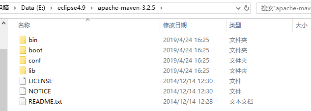

# Maven-Note
Maven学习笔记

## 一、Maven简介
是apache提供的项目管理工具，`Maven`是基于项目对象模型(POM)，可以通过一小段描述信息来管理项目的构建。  
Maven可以替我们更好的管理以上项目搭建、编译、打包、清理、测试等一系列操作。

## 二、Maven安装包目录结构
  

- bin：执行脚本所在的目录，如`mvn`
- boot：里面就一个jar包：`plexus-classworlds-2.5.2.jar`，是`maven`的类加载框架用来加载自己类库的
- conf：包含settings.xml文件，可以全局定制maven行为。编译工具会优先去~/.m2目录下读取settings.xml文件，如果没有读取到才会去maven的安装目录下读取settings.xml文件
- lib：该目录包含了maven运行时需要的java类库
-另外：
- 超级pom：`lib`包下找到`maven`内置的超级POM，存放在名叫`maven-model-builder`的jar包里面
解压之后进入`\org\apache\maven\model\`目录，在最后面，名为：`pom-4.0.0.xml`  
超级POM是所有maven项目的父pom，所有项目都继承这个超级pom，在maven的发行版中都会有  
超级pom中配置有  
　　1.中央仓库地址  
　　2.项目构建的默认目录  
　　3.自带的profile  
子pom.xml会完全继承父pom.xml中所有的元素，而且对于相同的元素，一般子pom.xml中的会覆盖父pom.xml中的元素，但是有几个特殊的元素它们会进行合并而不是覆盖  
（1）`dependencies`依赖  
（2）`plugin`插件  

## 三、Maven中setting文件
`settings.xml`文件一般存在于两个位置：
- 1、全局配置: ${M2_HOME}/conf/settings.xml
- 2、用户配置: ${user.home}/.m2/settings.xml  
>注意：用户配置优先于全局配置。`${user.home}` 和和所有其他系统属性只能在3.0+版本上使用。

## 四、settings.xml主要标签元素
```
<!--1、表示构建系统本地仓库的路径，默认值：{user.home}/.m2/repository-->
<localRepository>D:/.m2/repository</localRepository>

<!-- 2、配置远程仓库的用户名和密码 -->
<servers>
    <server>
      <id>epoint-nexus</id>
      <username>fengxianpeng</username>
      <password>fxp2016</password>
    </server>
</servers>

<!-- 3、远程仓库列表，它是Maven用来填充构建系统本地仓库所使用的 -->
<repositories>
        <repository>
          <id>epoint-nexus</id>
          <name>Epoint Nexus Repository</name>
          <url>http://192.168.0.99:8081/nexus/content/groups/public/</url>
		<releases>
		    <enabled>true</enabled>
		</releases>
		<snapshots>
		    <enabled>true</enabled>
		</snapshots>
        </repository>
</repositories>

<!-- 4、为仓库列表配置的下载镜像列表 -->
<mirror>
	<id>epoint-nexus</id>
	     <name>Epoint Nexus</name>
	     <url>http://192.168.0.99:8081/nexus/content/groups/public/</url>
	<mirrorOf>central</mirrorOf><!-- 被镜像的服务器的id,此处为中央仓库 -->
</mirror>
```


## 五、Maven 项目目录结构
- ${basedir}：存放pom.xml和所有的子目录，一般是src目录、pom.xml文件
- ${basedir}/src/main/java：项目的java源代码
- ${basedir}/src/main/resources：项目的资源，比如properties配置文件，springmvc.xml
- ${basedir}/src/test/java：项目的测试类，比如说Junit代码
- ${basedir}/src/main/webapp/WEB-INF：web应用文件目录，web项目的信息，比如存放web.xml
- ${basedir}/target：打包输出目录
- ${basedir}/target/classes：编译输出目录
- ${basedir}/target/test-classes：测试编译输出目录
- ~/.m2/repository：Maven默认的本地仓库目录位置

## 六、Maven常用命令
- 编译：mvn compile
- 打包：mvn package
- 清空：mvn clean（清除编译后目录，target目录）
- 打包并放到本地仓库中：mvn install
- 将jar包发布到私服：mvn deploy

## 七、pom文件
Project Object Model项目对象模型，定义了项目的基本信息，项目依赖，项目构建等  
pom文件里jar的依赖规则：  
- 1、先检查本地仓库是否有，有则直接依赖
- 2、否则会向远程仓库请求并下载到本地仓库

## 八、pom文件常用标签
### 1、基本信息
```
<modelVersion>4.0.0</modelVersion>
<groupId>com.epoint.ztbpb</groupId>
<artifactId>EpointPB.MidPlatform</artifactId>
<version>0.0.0.2-SNAPSHOT</version>
<packaging>war</packaging>
```
- （1）modelVersion：4.0.0，这是当前仅有的可以被Maven2&3同时支持的POM版本，它是必须的
- （2）groupId：定义了该项目属于哪个组，这与所在的组织和公司是有关联的，它是该组织域名的倒置
- （3）artifactId：这个定义了当前Maven项目组中的唯一ID
- （4）version：版本定义，一般分为快照版和发布版  
    快照版：版本号以SNAPSHOT为后缀的，maven更新的时候会自动从服务器上下载最新的快照版  
    发布版：在不更改版本号的情况下，如果本地仓库已经有了不会再去服务器更新   
- （5）packaging：打包方式，如果不说明，默认为jar方式，常用的有war、jar

#### 2、依赖信息
```
<dependencies>
   <dependency>
      <groupId>com.epoint.ztbpb</groupId>
      <artifactId>EpointPB.Frame</artifactId>
      <version>0.0.0.2-SNAPSHOT</version>
   </dependency>
</dependencies>
```
- （1）dependencies：依赖的root目录，所有的依赖都要放在这个大标签内
- （2）dependency：代表一个依赖，里面声明要依赖的信息
- （3）groupId、artifactId、version：用来定位要依赖的jar包的信息
- （4）scope：对依赖范围的说明  
 compile ：编译范围（默认），所有的classpath 中可用，同时它们也会被打包  
 provided ：依赖只有在当JDK 或者一个容器已提供该依赖之后才使用，不具有传递性，不会被打包  
 runtime：运行时范围，在运行和测试系统的时候需要，但在编译的时候不需要  
 test：测试范围，在一般的编译和运行时都不需要，在测试的编译和运行时可用  
system：范围依赖与provided类似，但是必须显示的提供一个对于本地jar文件的路径，此方式为引入非maven仓库的本地jar包，不推荐使用  
- （5）exclusions：排除jar包的root目录，所有的排除都要放在这个大标签内
- （6）exclusion：代表一个排除，里面声明要排除的信息（只需groupId、artifactId即可，不用指明版本号）

#### 3、插件配置
```
<build>
    <plugins>
        <!-- tomcat运行插件 -->
        <plugin>
           <groupId>org.apache.tomcat.maven</groupId>
           <artifactId>tomcat7-maven-plugin</artifactId>
           <version>${tomcat7_maven_plugin_version}</version>
           <configuration>
              <path>/${project.artifactId}</path>
              <port>8087</port>
              <uriEncoding>${file_encoding}</uriEncoding>
              <url>http://localhost:8087/</url>
              <server>tomcat7</server>
           </configuration>
        </plugin>
      </plugins>
</build>
```
- （1）build：是对项目构建声明的大标签，里面所有声明都与项目的构建有关
- （2）plugins：这个是所有插件的root标签
- （3）plugin:此标签代表为一个插件
- （4）groupId、artifactId和version三个标签声明了该插件的坐标
- （5）configuration：此标签内声明了对该插件的配置，此标签内的子标签随着插件的不同而不同

#### 4、全局配置
```
<properties>
    <spring-version>4.1.9.RELEASE</spring-version>
    <tomcat7-maven-plugin-version>2.2</tomcat7-maven-plugin-version>
    <project.build.sourceEncoding>UTF-8</project.build.sourceEncoding>
</properties>
```

- properties：用于声明全局配置的根目录
这个配置非常的自由，可以声明出任何标签  
使用方式：  
```
<dependency>
   <groupId>org.springframework</groupId>
   <artifactId>spring-web</artifactId>
   <version>${spring-version}</version>
</dependency>
```

## 九、Maven的依赖冲突
#### 1、短路优先
  C->B->A->X1(jar)  
	C->B->X2(jar)  
C依赖B,B依赖A,A和B都包含同一个不同版本的Jar,则取B的依赖版本。（c的pom.xml中不必注明jar坐标）
#### 2、先声明优先
如果路径相同长度相同，则谁先声明，先解析谁  
C依赖A和B,A和B都包含同一个不同版本的Jar,谁依赖在前取谁的依赖版本  

## 十、Maven仓库和镜像的区别
#### 1、repository仓库。
maven里有两种仓库，本地仓库和远程仓库。远程仓库相当于公共的仓库，大家都能看到。  
本地仓库是你本地的一个山寨版，只有你看的到，主要起缓存作用。  
当你向仓库请求插件或依赖的时候，会先检查本地仓库里是否有。如果有则直接返回，否则会向远程仓库请求，并做缓存。  
#### 2、mirror镜像
mirror则相当于一个代理，它会拦截去指定的远程repository下载构件的请求，然后从自己这里找出构件回送给客户端。配置mirror的目的一般是出于网速考虑。  
镜像就是一个远程仓库的一个映射仓库，在国内来说，意义上相当于代理的作用。比如中央仓库因为服务器在国外，又因为某些不可描述的原因，所以国内开发人员从中央仓库中下载的依赖包会因为各种各样的网络因素导致错误或则下载十分缓慢。所以这时候镜像的作用的显现出来了。  
可以说，镜像就是国外公共仓库的网络加速器，也可以说镜像是国外仓库在国内的版本。  
