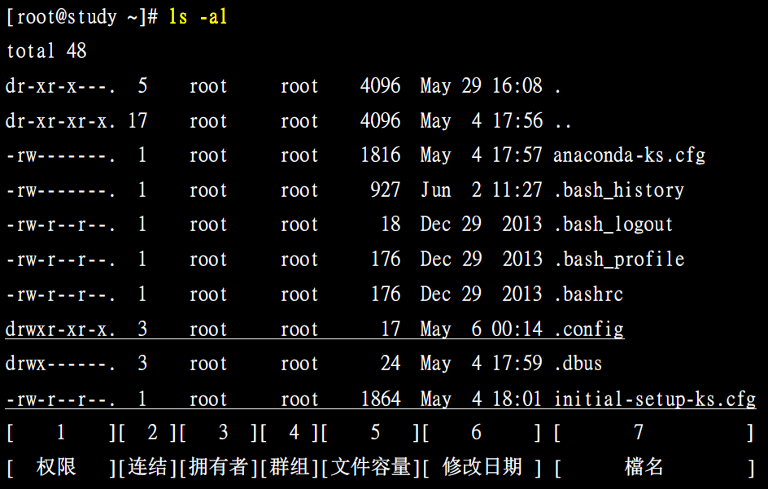
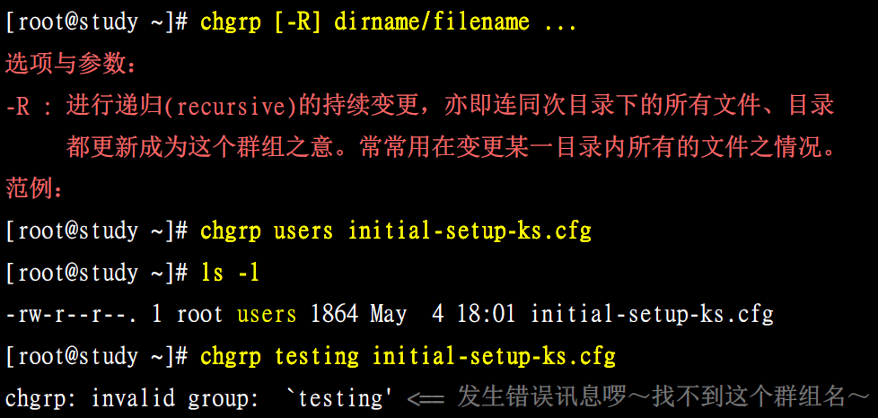
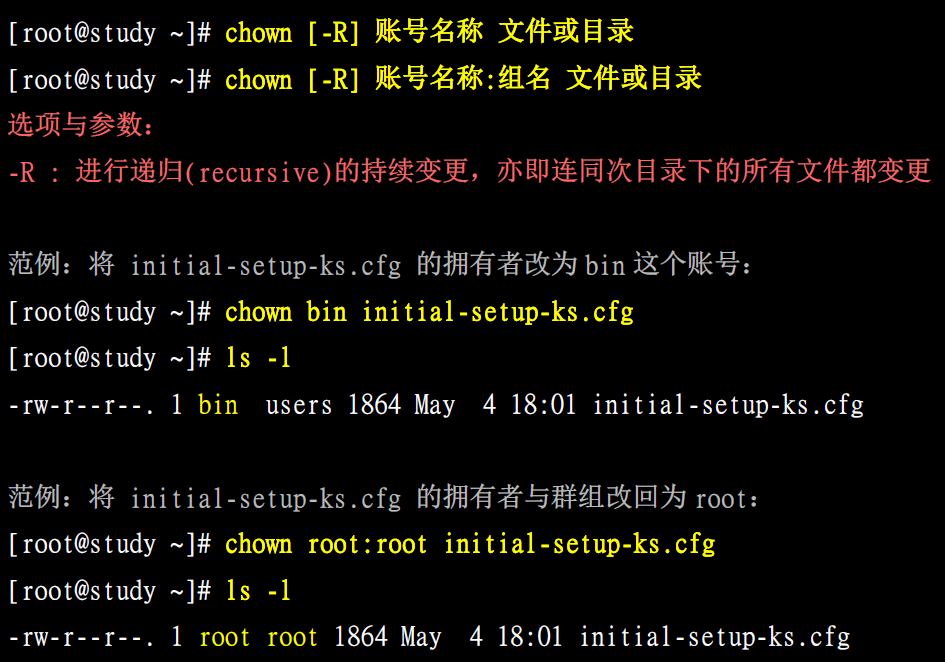
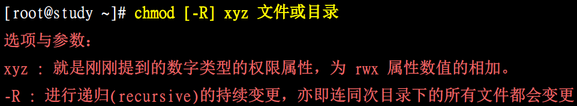
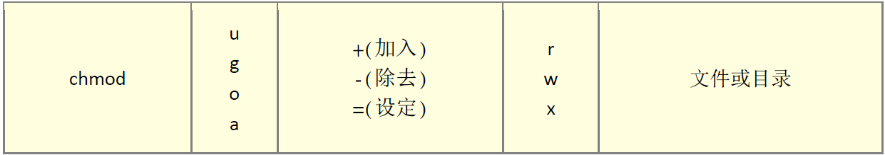
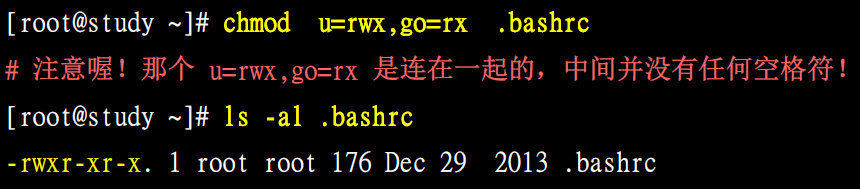
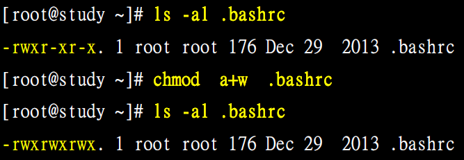
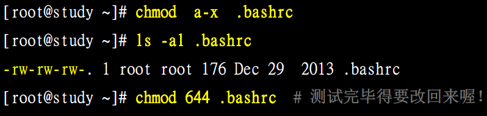
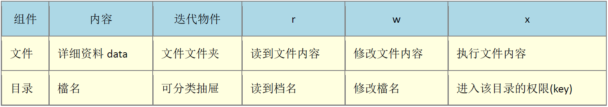

# Linux的文件权限

## 序
Linux最优秀的地方之一就在于他的多人多任务环境。而为了让各个使用者具有较保密的文件数据，因此文件的权限管理就变的很重要了。  
Linux一般将文件可存取的身份分为三个类别，分别是 owner/group/others，且三种身份各有 read/write/execute 等权限。  

## Linux用户身份与群组记录的文件
/etc/passwd ：默认情况下，系统是上的账号与一般身份使用者和root的相关信息，存放在此文件内。  
/etc/shadow ：存放个人密码  
/etc/group ：存放所有的组名  

### Linux文件属性  

### 命令解析
          ls  【list的意思】   
         -al  【表示列出所有的文件详细的权限与属性，包含隐藏文件（就是文件名第一个字符为.的文件）】  

### 结果解析：
#### 1、第一列：文件的类型与权限
如：-rwxrwx---  
第一个字符：文件的类型  
- （1）d 代表目录  
- （2）- 代表文件  
- （3）l 表示为连结档（link file）  
- （4）b 表示为装置文件里面的可供存储的接口设备（可随机存取装置）  
- （5）c 表示为装置文件里面的串行端口设备，例如键盘、鼠标（一次性读取装置）  

接下来的字符，以三个为一组，且均为 [ rwx ]，其中 r 代表可读（read），w 代表可写（write），x 代表可执行（execute），这三个权限位置不会变，如果没有权限就会出现减号 - 而已。  
以三个为一组，按顺序，其中：  
- 第一组：表示文件拥有者可具备的权限  
- 第二组：表示加入此群组的账号的权限  
- 第三组：表示非本人且没有加入群组的其他账号的权限  

#### 2、第二列：表示有多少档名连结到此节点
每个文件都会将他的权限与属性记录到文件系统的i-node中，不过，我们使用的目录树却是使用文件名来记录， 因此每个档名就会连结到一个i-node。这个属性记录的，就是有多少不同的档名连结到相同的一个i-node号码去了。

#### 3、第三列：表示这个文件或目录的拥有者账号
#### 4、第四列：表示这个文件的所属群组
#### 5、第五列：表示文件的容量大小，默认单位为bytes
#### 6、第六列：表示此文件的创建日期或者是最近的修改日期
如果想要显示完整的时间格式，可以利用ls的选项，亦即：『ls -l --full-time』就能够显示出完整的时间格式了！包括年、月、日、时间。
#### 7、第七列：表示文件的名称
如果文件名称的前面多一个点 . ，则代表这个文件为隐藏文件

## 如何修改文件的属性与权限
- chgrp：改变文件所属群组
- chown：改变文件拥有者
- chmod：改变文件权限

### chgrp：改变文件所属群组
chgrp命令可以理解为就是change group的缩写。
注意，要被改变的组名必须要在/etc/group文件内才行，否则会出错：  
假设/etc/group文件中存在名为users的群组，不存在testing的群组  

### chown：改变文件拥有者
change owner的缩写  
注意，必须是/etc/passwd文件中的用户才可以改变所有者。  

### chmod：改变文件权限
权限的设定方法有两种：一种是使用数字，一种是使用符号  
#### （1）数字类型改变文件权限
权限与数字参照表：  
r：4  
w：2  
x：1  
每种身份 每种身份 (owner/group/others)各自的三个权限 各自的三个权限 各自的三个权限 (r/w/x)数字是需要累加的，例如当权限为： [-rwxrwx---]  
owner：4 + 2 + 1 = 7  
group：4 + 2 + 1 = 7  
others：0 + 0 +0 = 0  
所以，还文件的权限数字是770，变更权限的命令语法如下：  

#### （2）符号类型改变文件权限
分别用符号u，g，o来表示user、group、others三种身份，另外，a表示all即全部身份。  
那么读写的权限就可以写成r、w、x，也就是可以用如下的方式来看：  

比如，设定一个文件的权限为[-rwxr-xr-x]，基本上就是：  
user（u）：具有可读、可写、可执行的权限  
group与others（g/o）：具有可读与执行的权限  
就是：  

此外还可以使用+和-来对已有的权限进行加或减：  
  
  

## 权限对文件的意义
- r（read）：可读取此文件的实际内容
- w（write）：可以编辑、新增、或者是修改该文件的内容（但不包括删除该文件）
- x（eXecute）：该文件具有可以被系统执行的权限

## 权限对目录的意义
- r (read contents in directory)：  
表示具有读取目录结构列表的权限，所以当你具有读取一个目录的权限时，表示你可以查询该目录下的文件名数据。  

- w (modify contents of directory)：  
表示拥有如下权限：建立新的文件与目录，删除已存在的文件与目录，将已存在的文件或目录进行更名，搬移该目录内的文件或目录位置。总之，w权限就与该目录底下的文件名异动有关。  

- x (access directory)：  
目录不可以被执行，所以x代表的是用户能否进入该目录成为工作目录的用途。  
对以上的权限进行汇总：  

根据上述的分析，你可以看到，对一般文件来说，rwx 主要是针对『文件的内容』来设计权限，对目录来说，rwx则是针对『目录内的文件名列表』来设计权限。

Linux文件长度限制
单一文件或目录的最大容许文件名为255bytes，以一个ASCII英文占用一个bytes来说，则大约可达255个字符长度，若是以每个中文占两个字节来说，最大文件名就是大约在128个中文字。

Linux文件名的限制
文件名应避免以下特殊字符
* ? > < ; & ! [ ] |  \ ' " ` ( ) { } - +
