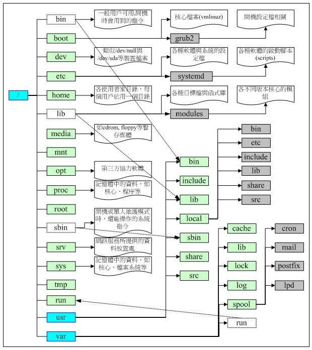

# Linux目录配置

## Linux目录配置的依据
Linux目录配置的依据——FHS（Filesystem Hierarchy Standard  文件系统层次化标准）的缩写。

### FHS针对目录树架构定义出三层目录下应该放置什么数据：
- /（root，根目录）：与开机系统有关
- /usr（unix software resource）：与软件安装/执行有关
- /var（variable）：与系统运作过程有关

### 根目录（/）的意义与内容
- 所有的目录都是由根目录衍生出来的，同时根目录也是与开机、还原、系统修复等动作有关。
- FHS标准建议：根目录（/）所在的分区槽应该越小越好，且应用程序安装的软件最好不要与根目录放在同一个分区槽内。

### FHS要求必须要存在的目录
- /bin  
放置执行文件的目录，且放置的是在单人维护模式下还能被操作的指令。下面的指令可以被root和一般账号所使用，如：cat、chmod、chown、date、mv、mkdir、cp、bash等等。   

- /boot  
主要放置开机会用到的文件，包括Linux核心文件以及开机所需的配置文件等。  

- /dev  
任何装置与接口设备都是以文件的形态存在于这个目录中。  

- /etc  
系统主要的配置文件几乎都放置在这个目录中，例如账号密码文件，各种服务的启动文件等等。  

- /lib  
放置开机时会用到的函数库，以及在/bin或/sbin下的指令会调用的函数库。  

- /media  
放置可移除装置，包括软盘、光盘、DVD等。  

- /mnt  
挂载额外装置。较早版本中这个目录的用途和/media相同，在有了/media之后这个目录就用来暂时挂载用了。  

- /opt  
第三方软件放置的目录，以前的Linux系统中，习惯放置在/usr/local 目录下  

- /run  
放置系统开机后产生的各项信息，老版本放在/var/run中  

- /sbin  
放置开机过程中所需的指令，包括开机、修复、还原系统等所需的指令。  

- /srv  
可以视为service的缩写，是一些网络服务启动之后，这些服务所需要取用的数据目录。常见的入WWW、FTP等。  

- /tmp  
一般用户或者是正在执行的程序暂时放置文件的地方，此目录任何人都可以存取，所以要定期清理。  

- /usr  
放置的数据属于可分享的但不可变动的。  
  - /usr/bin  
  所有一般用户能够使用的指令都放在这里，/bin目录连结至此，所以两个目录一样。另外此目录下不应该有子目录。  
  - /usr/lib  
  基本上与/lib相同，所以/lib就是连接到此目录中的。  
  - /usr/local  
  系统管理员在本机自行安装自己下载的软件，建议安装到此目录。  
  - /usr/sbin  
  系统正常运作所需的系统指令  
  - /usr/share  
  主要放置只读架构的数据文件，也包括共享文件。  

- /var  
  此目录主要针对常态变动的文件，包括程序文件或者MySQL数据库文件等等  
  - /var/cache  
  应用程序本身运作过中会产生的一些缓存文件  
  - /var/lib  
  程序本身执行的过程中，需要使用到的数据文件放置的目录。在此目录下各自的软件应该有各自的目录。比如，MySQL数据库放置到/var/lib/mysql.   
  - /var/log  
  登录文件放置的目录
  - /var/run  
  某些程序或者是服务启动后，会将他们的PID放置到这个目录下。与/run相同，这个目录链到/run去了。  

## 目录树
Linux下，所有的文件与目录都是由根目录开始的，是所有目录与文件的源头，然后一个一个分支下来，这种目录配置称为：目录树

### 目录树的主要特性：
- （1）目录树的启动点为根目录（/，root）
- （2）每一个目录不止能使用本地端的文件系统，也可以使用网络上的文件系统，比如NFS服务器挂载某特定目录。
- （3）每一个文件在此目录树的文件名（包含完整路径）都是独一无二的。

#### 目录树的架构大致如下：

## 绝对路径与相对路径
绝对路径：由根目录（/）开始写起的文件名或目录名称  
相对路径：相对于当前路径的文件名写法。  

另外：  
. ：代表当前的目录，也可以用 ./ 来表示  
..：表示代表上一层目录，也可以用 ../ 来表示  
