# Linux的文件与目录管理

## 目录的相关操作
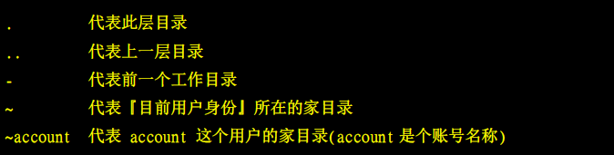  
在所有的目录下面都会有两个目录，分别是『.』与『..』，分别代表此层与上层的意思。  
特例：  
根目录下也存在『.』与『..』目录，这两个目录的权限属性完全一致，这代表根目录的自己『.』与上一层『..』是同一个目录。  

### 处理目录的指令
- cd：变换目录  
cd - 表示回到目前的上层目录  

- pwd：显示当前目录  
pwd -P 显示出真实的路径，而非使用连接（link）的路径

- mkdir：建立一个新的目录  
mkdir [-mp]  
-m：配置文件的权限  
-p：递归创建目录  

- rmdir：删除一个空的目录  
rmdir [-p] 目录名称  
-p：连同上层空的目录也一起删除  

### 关于执行文件路径的变量：$PATH
当使用一个指令的时候，以ls为例，系统会根据PATH的设定去每个PATH定义的目录下搜寻文件名为ls的可执行文件，如果PATH定义的目录中包含多个，那么先搜寻到的指令会被先执行。  
使用echo $PATH会显示出当前的PATH定义  
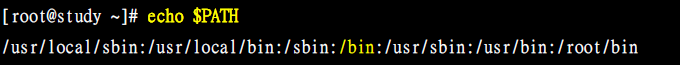  
注意：PATH要大写，每个目录中间用冒号(:)来隔开，每个目录是有顺序之分的  
#### 总结：
1、不同身份使用者预设的PATH不同，默认能够随意执行的指令也不相同  
2、PATH是可以修改的  
3、使用绝对路径或相对路径直接指定某个指令的文件名来执行，会比搜寻PATH来的正确  
4、指令应该放置到正确的目录下，执行才会比较方便  
5、本目录(.)最好不要放到PATH当中  

## 文件与目录管理
### 文件目录的检视：ls
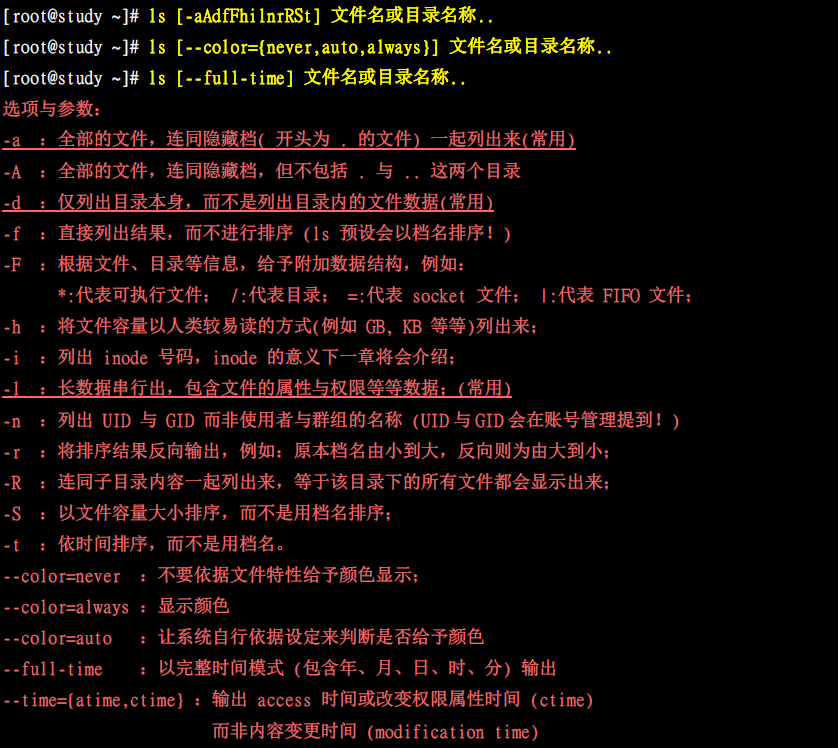  

### 复制文件或目录：cp  
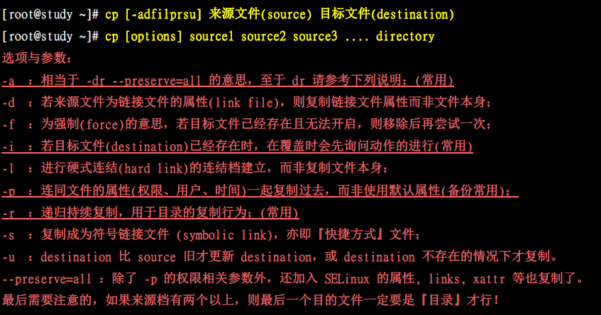  

### 移除文件或目录：rm
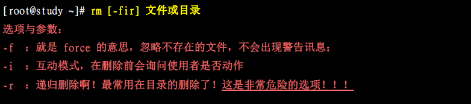  

### 移动文件或目录：mv
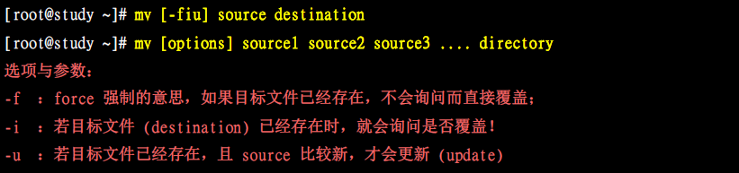   

取得路径的文件名与目录名称  
根据斜线(/)来分辨是文件名还是目录名  
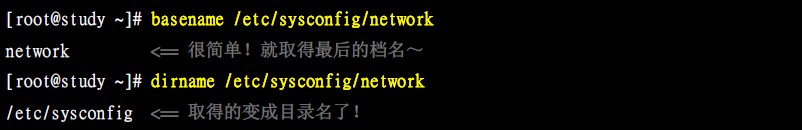  

## 文件内容查阅
- cat：由第一行开始显示文件内容
- tac：从最后一行开始显示，是cat的倒着写
- nl：显示的时候，顺道输出行号
- more：一页一页的显示文件内容
- less：同上，但可以往前翻页
- head：只看头几行
- tail：只看后几行
- od：以二进制的方式读取文件内容

### cat
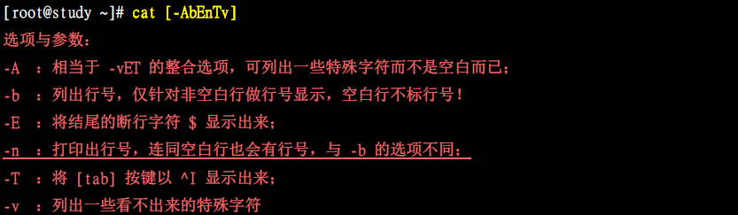  

### nl（添加行号打印）
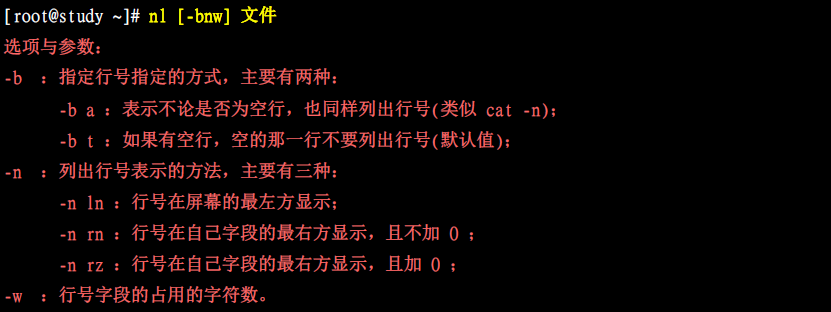  

### head（取前几行）
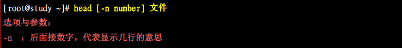  

### tail（取后几行）
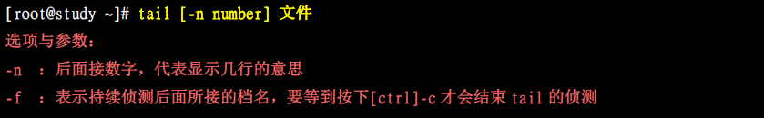  

## 修改文件时间或创建新文件：touch
ls指令查看文件的时候，会有许多时间记录，有三个主要变动的时间：  
- 1、mtime：当该文件内容数据变更时，就会更新这个时间
- 2、ctime：文件状态改变时会更新这个时间，比如权限与属性被更改
- 3、atime：该文件内容被取用时，就会更新这个读取时间

ls 默认显示出来的是该文件的mtime，也就是文件上次被更改的时间。

如果文件时间误判，可能会造成程序无法顺利运行，万一某个文件来自未来，如何让文件的时间变成现在？使用touch命令：  
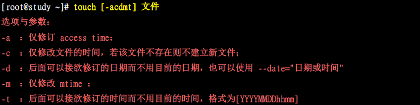  
#### touch最常被使用的情况是：
- 1、建立一个空的文件
- 2、将某个问价日期修订为目前（mtime与atime）

## 文件与目录的默认权限
文件预设权限：`umask`  
`umask`就是指：目前用户在建立文件或目录时候的权限默认值，查看方式如下：  
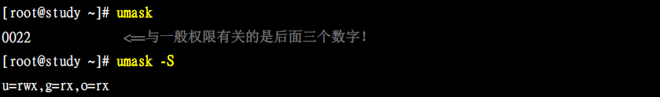  
可以发现，数字权限会有四组，后三组是我们常见的，第一个数字是特殊权限用的。  
另外需要注意：**umask的分数指的是该默认值要减掉的权限。**  

## 文件隐藏属性
- 文件具有SUID的特殊权限时，代表当用户执行此binary程序时，在执行过程中用户会暂时具有程序拥有者的权限。
- 目录具有SGID的特殊权限时，代表用户在这个目录底下新建的文件之群组都会与该目录的组名相同。
- 目录具有SBIT的特殊权限时，代表该目录下用户建立的文件只有自己与root能够删除。

## 观察文件的类型：file
查看某个文件的基本数据，例如是属于ASCII或data文件，使用file命令：  
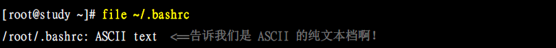  

## 指令与文件的搜寻
终端连续两次[tab]按键就可以知道用户有多少命令可以使用，但不知道这些命令的完整路径。  
利用which或type来搜寻。  
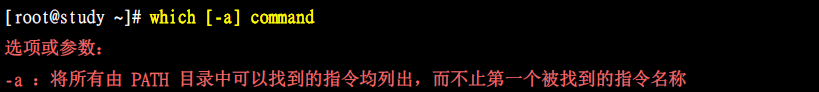  

## 文件名的搜寻
在特定目录中寻找文件名：whereis  
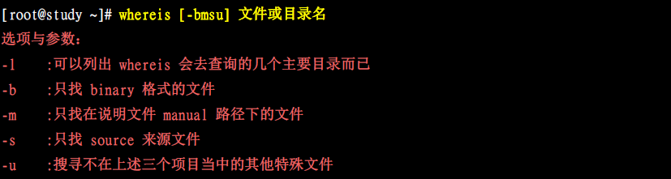  
whereis只是根据几个特殊目录来处理的，速度比较快，要想知道whereis到底查了多少目录，使用whereis -l来确认一下。  

### locate
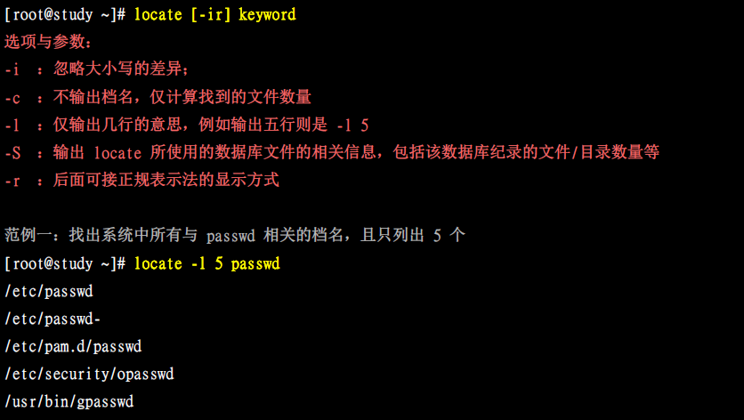  

### find
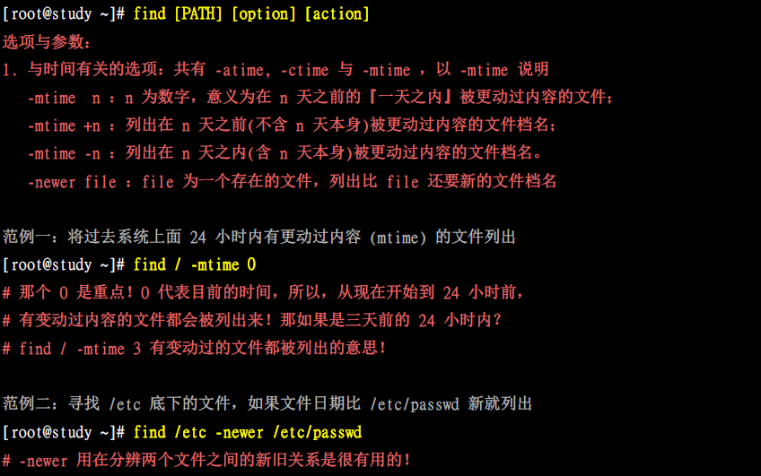  
例如：  
find file -mtime 4  
find file -mtime +4  
find file -mtime -4  
其搜索的时间范围如下：  
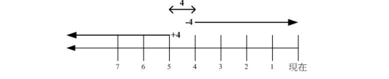  
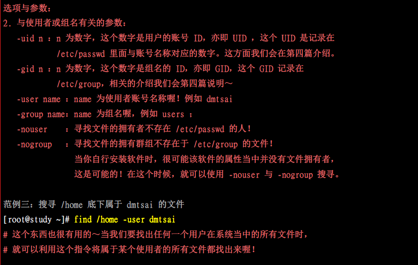  
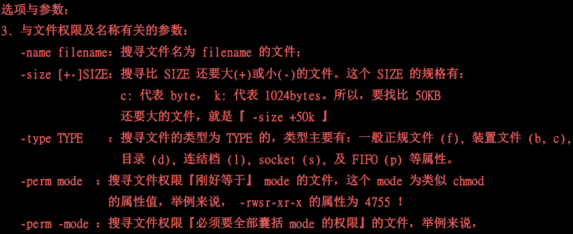  
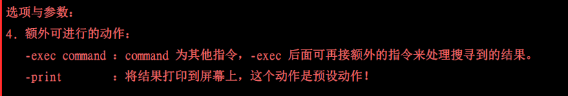  
