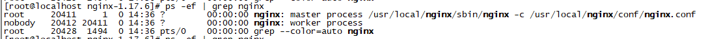

# Nginx的启动和停止


## Nginx的启动
假设Nginx安装在/usr/local/nginx目录中，那么启动Nginx的命令就是：  
```shell
/usr/local/nginx/sbin/nginx -c /usr/local/nginx/conf/nginx.conf
```
参数“-c”指定了配置文件的路径，如果不加“-c”参数，Nginx会默认加载其安装目录的conf子目录中的nginx.conf文件，在本例中即：/usr/local/nginx/sbin/nginx/conf/nginx.conf。

## Nginx的停止
Nginx的停止方式有很多种，一般通过发送系统信号给Nginx主进程的方式来停止Nginx。  
可以通过ps命令来查找Nginx的主进程号：
```shell
ps -ef | grep nginx
```  
查询结果如下图所示：  
  
从上图可以看到，1个Nginx进程的备注信息为“master process”，表示它为主进程，另外一个进程备注信息为“worker process”，表示它们为子进程。20411为主进程号。  
如果在nginx.conf配置文件中指定了pid文件存放的路径，该文件中存放的就是Nginx当前的主进程号。如果没有指定pid文件存放的路径，Nginx.pid文件默认存放在nginx安装目录的logs目录下。所以，可以直接通过以下命令来完成平滑重启，省下寻找Nginx主进程号的步骤：  
```shell
kill - 信号类型 `/usr/local/webserver/nginx/logs/nginx.pid`
```
(1) 从容停止Nginx  
kill -QUIT Nginx主进程号
```shell
kill -QUIT `/usr/local/webserver/nginx/logs/nginx.pid`
```
(2) 快速停止Nginx  
kill -TERM Nginx主进程号  
```shell
kill -TERM `/usr/local/webserver/nginx/logs/nginx.pid`
```
或
kill -INT Nginx主进程号  
```shell
kill -INT `/usr/local/webserver/nginx/logs/nginx.pid`
```
(3) 强制停止所有Nginx进程  
```shell
pkill -9 nginx
```

## Nginx的平滑重启
### 平滑重启
平滑重启不同于普通的重启，平滑重启可以做到在不影响用户的情况下重启服务，以便重新载入程序，完成业务代码更新。  
平滑重启一般应用于业务更新或者版本发布过程中，能够避免因为代码发布重启服务导致的暂时性服务不可用的影响。  
### Nginx的平滑重启
如果改变了Nginx的配置文件（nginx.conf），想重启nginx，同样可以通过发送系统信号给Nginx主进程的方式来进行。重启之前要确认Nginx配置文件的语法是否正确的，否则Nginx将不会加载新的配置文件。通过以下命令可以判断Nginx配置文件是否正确：  
```shell
/usr/local/webserver/nginx/sbin/nginx -t -c /usr/local/webserver/nginx/conf/nginx.conf
```
可以根据提示信息辨别语法是否有错误。  
如果语法正确，就可以通过以下命令平滑重启Nginx了：  
kill -HUP Nginx主进程号  
```shell
kill -HUP `/usr/local/webserver/nginx/logs/nginx.pid`
```
当Nginx接收到 HUP 信号时，它会尝试先解析配置文件，如果成功，就应用新的配置文件。之后，Nginx运行新的工作进程并从容关闭旧的工作进程。所有客户端的服务完成后，旧的工作进程被关闭，如果新的配置文件应用失败，Nginx将继续使用旧的配置进行工作。  

## Nginx信号控制
Nginx支持以下几种信号：
- TERM，INT 快速关闭
- QUIT 从容关闭
- HUP 平滑重启，重新加载配置文件
- USR1 重新打开日志文件，在切割日志时用途较大
- USR2 平滑升级可执行程序
- WINCH 从容关闭工作进程

## Nginx的平滑升级
当需要将正在运行的Nginx升级、添加或删除服务器模块时，可以在不中断服务的情况下，使用新版本、重编译的Nginx可执行程序替换旧版本的可执行程序。步骤如下：  
（1）使用新的可执行程序替换旧的可执行程序，对于编译安装的Nginx，可以将新版本编译安装到旧版本的Nginx安装路径中。替换之前，最后先备份一下旧的可执行文件。  
（2）发送以下命令  
```shell
kill -USR2 旧版本的Nginx主进程号
```
（3）旧版本Nginx的主进程将重命名它的.pid文件为.oldbin（例如：/usr/local/webserver/nginx/logs/nginx.pid.oldbin），然后执行新版本的Nginx可执行程序，依次启动新的主进程和新的工作进程。  
（4）此时，新旧版本的Nginx实例会同时运行，共同处理输入请求。要逐步停止旧版本的Nginx实例，需要发送 WINCH 信号给旧的主进程，然后，它的工作进程就将开始从容关闭：  
```shell
kill -WINCH 旧版本Nginx主进程号  
```
（5）一段时间后，旧的工作进程处理了所有已连接的请求后退出，仅由新的工作进程来处理输入的请求了。  
（6）这时候，可以决定是使用新版本还是恢复到旧版本：  
Kill -HUP 旧的主进程号：Nginx将在不重载配置的情况下启动它的工作进程；  
kill -QUIT 新的主进程号：从容关闭其工作进程；  
kill -TERM 新的主进程号：强制退出；  
kill 新的主进程号或旧的主进程号：如果因为某些原因新的工作进程不能退出，则向其发送kill信号。  
新的主进程退出后，旧的主进程会移除.oldbin后缀，恢复为它的.pid文件，这样，一切都恢复到升级之前了。  
如果升级成功，而你也希望保留新的服务器时，可发送 QUIT 信号给旧的主进程，使其退出而只留下新的服务器运行。
