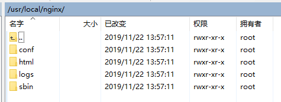

# Nginx的安装与配置

## 概述
Nginx是一款高性能的HTTP和反向代理服务器。在高连接并发的情况下，Nginx是Apache服务器不错的替代品，它能够支持高达50000个并发连接数的响应，而内存、CPU等系统资源消耗却非常低，运行非常稳定。

## Nginx的优点：
1、它可以支持高并发连接  
2、内存消耗少  
3、成本低廉（开源软件）  
4、配置文件非常简单  
5、支持Rewrite重写规则（能给根据域名、URL的不同，将HTTP请求分到不同的后端服务器群组）  
6、内置的健康检查功能（如果Nginx Proxy后端某台Web服务器宕机了，不会影响前端访问）  
7、节省带宽（支持GZIP压缩，可以添加浏览器本地缓存的Header头）  
8、稳定性高（用于反向代理，宕机的概率微乎其微）  
9、支持热部署（它的启动特别容易，几乎可以不间断地运行，即使运行数个月也不需要重新启动，能够在不间断服务的情况下，对软件版本进行升级）  

## Nginx的安装
以Linux方式安装为例：  
获取安装包后放到Linux的目录下  
  

然后运行解压命令，将压缩包解压至当前目录：  
```shell
tar -zxvf nginx-1.17.6.tar.gz
```
  

然后进入解压后的目录下，运行`./configure`执行安装
如下图，会进行一些检查，发现最后报错，缺少依赖：
  
  

安装依赖，执行下面三条命令：
```shell
yum -y install gcc gcc-c++ autoconf automake make

yum -y install pcre-devel

yum -y install openssl openssl-devel
```
依赖安装完成后执行以下命令安装Nginx  
```shell
./configure
make
make install
```
执行结束如下图所示：  
  
按照以上命令，Nginx将被默认安装到/usr/local/nginx目录下，如下图  
  

若想在安装时自定义一些配置，可通过`./configure`进行配置  

Nginx的`configure`脚本支持以下选项（部分）：  

|选项|说明|
|:---|:---|
|--prefix=`<path>`|Nginx的安装路径。如果没有指定，默认为/usr/local/nginx|
|--sbin-path=`<path>`|Nginx可执行文件安装路径。只能安装时指定，如果没有指定，默认为`<prefix>`/sbin/nginx|
|--conf-path=`<path>`|在没有给定-c选项下默认的nginx.conf的路径。如果没有指定，默认为`<prefix>`/conf/nginx.conf|
|--pid-path=`<path>`|在nginx.conf中没有指定pid指令的情况下，默认的Nginx.pid的路径。如果没有指定，默认为`<prefix>`/logs/nginx.pid|
|--lock-path=`<path>`|nginx.lock文件的路径|
|--error-log-path=`<path>`|在nginx.conf中没有指定error_log指令的情况下，默认的错误日志路径。如果没有指定，默认为`<prefix>`/logs/error.log|
|--http-log-path=`<path>`|在nginx.conf中没有指定access_log指令的情况下，默认的访问日志的路径。如果没有指定，默认为`<prefix>`/logs/access.log|
|--user=`<user>`|在nginx.conf中没有指定user指令的情况下，默认的Nginx使用的用户。如果没有指定，默认为nobody|
|--group=`<group>`|在nginx.conf中没有指定user指令的情况下，默认的Nginx使用的组。如果没有指定，默认为nobody|
|--builddir=Dir|指定编译的目录|
|--with-rtsig_module|启用rtsig模块|
|--with-select_module<br/>(--without-select_module)|允许或不允许开启SELECT模式|
|--with-http_ssl_module|开启HTTP SSL模块，使Nginx可以支持HTTPS请求，这个模块需要已经安装OPENSSL，在DEBIAN上是libssl|
|--http-log-path=PATH|指定http默认访问日志的路径|
