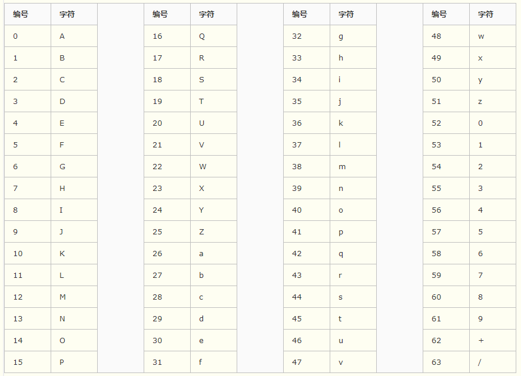

# Base64编码

## 概述
实质是一种编码，对数据内容进行编码来适合传输，是网络上常见的用于传输8bit字节数据的一种编码方式之一（基于64个可打印的字符来表示二进制的数据的一种方法）。

## 原理
Base64编码将一个8位字节序列拆散为6Bit的片段，然后把6Bit再添两位高位0，组成四个8Bit的字节，也就是说，转换后的字符串理论上将要比原来的长1/3。为每个6Bit(补位后为8Bit)的片段分配一个字符，这个字符是Base64字母表中的64个字符之一。

## 原则
把3个字符变成4个字符    3 x 8 = 4 x 6  
上述情况字符满足被3整除，若不满足这种情况，需要用0来补齐。因为是需要补齐而出现的0，转化成十进制的时候就不能按常规用base64编码表来对应，所以不是a， 可以理解成为一种特殊的“异常”，编码应该对应“=”  
  
1 ：  第一个字符的前六位   
2 ：  第一个字符的后二位  加  第二个字符的前四位  x1&3   <<4      |   x2>>4  
3 ：  第二个字符的后四位  加 第三个字符的前二位  x2 & 0x0f <<2    |   x3>>6  
4 ：  第三个字符的后六位          x3 & 0x3f

eg:  
aaaa  
|a|a|a|a|a|
|:---|:---|:---|:---|:---|
|01100001| 01100001 |01100001 |01100001 |    00000000 |00000000  |
|011000 | 010110| 000101 |100001| 011000| 010000 |000000 |000000  |
|24    |    22   |    5    |    33    |    24   |   16  |  0    |  0  |
编码后的Base为：YWFhYQ==

## 附Base64对照表 

